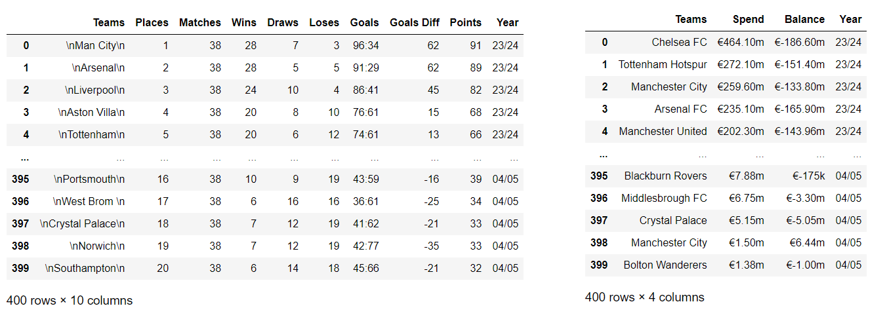
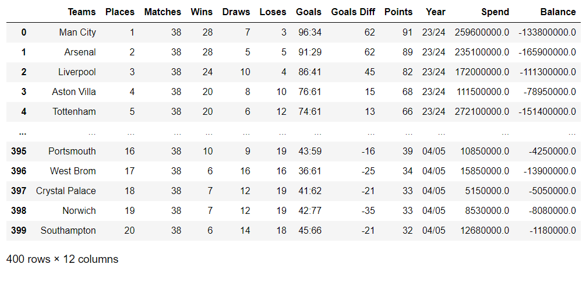
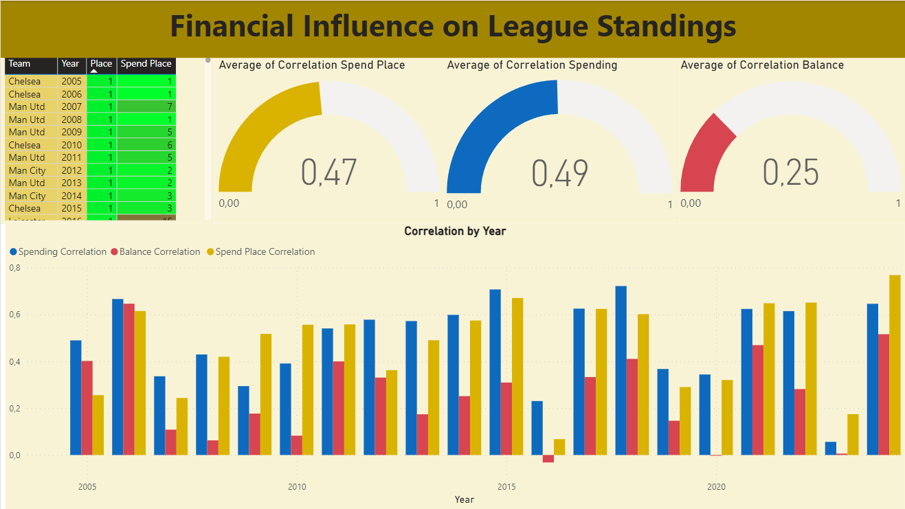
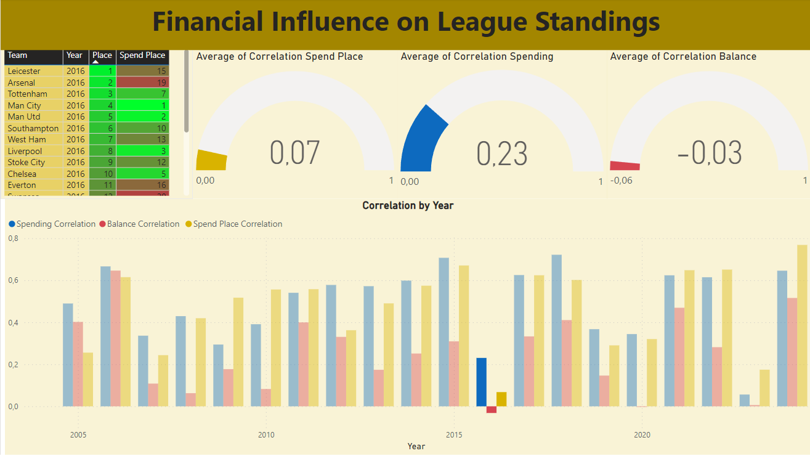
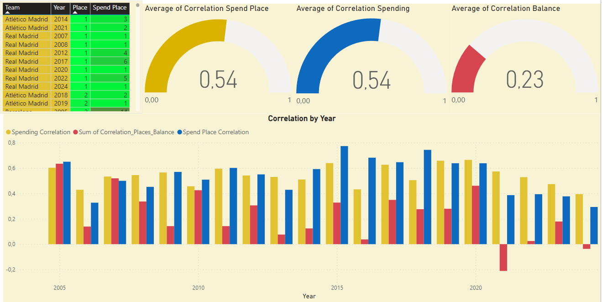

# Finding correlation, between spending money on transfers and team place in league using web scraping.

This project consists of Python scripts to scrape data from the [Transfermarkt website](https://www.transfermarkt.co.uk/). It gathers season statistics and transfer data for the Premier League using Selenium and BeautifulSoup. 

Next, we utilize Python and pandas for data cleaning and correlation calculations. Finally, Power BI is employed to create reports that provide insights into these correlations for both the Premier League and La Liga.


## Web Scraping Functions

First, we obtain the data from the website using web scraping techniques. This involves using the following functions:

### initialize_driver

This function initializes a Chrome WebDriver instance and navigates to the given URL. It also sets an implicit wait of 5 seconds for the driver to handle dynamic page elements.


```python

def initialize_driver(url):
    driver = webdriver.Chrome()
    driver.get(url)
    driver.implicitly_wait(5)
    return driver


```


### adjust_zoom

This function adjusts the zoom level of the webpage to ensure that all content is visibles(which is necessary for Selenium). It uses the PyAutoGUI library to simulate the `Ctrl` + `-` (zoom out) keyboard shortcut.


```python
def adjust_zoom(driver, zoom_out_times=6):
    for _ in range(zoom_out_times):
        pyautogui.hotkey('ctrl', 'subtract')
```


### getting_new_webpage

  ```python
def getting_new_webpage(driver, season_text, next_season_text):
```

This function navigates to the webpage of a specific season by clicking on the appropriate elements and handles possible variations in button names. It returns the rows (`tr`) of the season table.
<details>
  <summary>getting_new_webpage code</summary>

  ```python

  def getting_new_webpage(driver, season_text, next_season_text):
    time.sleep(1)
    element = driver.find_element(By.XPATH, f'//span[text()="{season_text}"]')
    ActionChains(driver).click(element).send_keys(next_season_text).perform()
    ActionChains(driver).send_keys(Keys.ENTER).perform()
    
    # Check if a second interaction is necessary, because in transfer webpage we have season from "" until ""
    try:
        element = driver.find_element(By.XPATH, f'//span[text()="{season_text}"]')
        ActionChains(driver).click(element).send_keys(next_season_text).perform()
        ActionChains(driver).send_keys(Keys.ENTER).perform()
    except:
        print(f"No second interaction required for season {season_text}.")
    
    # In webpage with season statistics we have "Show" button
    try:
        button = driver.find_element(By.CSS_SELECTOR, 'input[type="submit"].button.small[value="Show"]')
        button.click()
        print(f"Clicked 'Show' for season {next_season_text}.")
    # In webpage with transfer season we have "Display selection" button
    except:
        try:
            button = driver.find_element(By.CSS_SELECTOR, 'input[type="submit"].button.small[value="Display selection"]')
            button.click()
            print(f"Clicked 'Display selection' for season {next_season_text}.")
        except Exception as e:
            print(f"Failed to click button for season {next_season_text}: {e}")

    html = driver.page_source
    soup = BeautifulSoup(html, 'html.parser')
    table = soup.find('table', class_="items").tbody
    trs = table.find_all('tr')

    return trs
```
</details>


### getting_season_data
This function parses the rows (`tr`) of the season table to extract statistics such as team names, places, matches, wins, draws, losses, goals, goal differences, and points. It stores the data in a pandas DataFrame.
  
  ```python
def getting_season_data(trs, next_season_text):
```

<details>
  <summary>getting_season_data code</summary>


  ```python

  def getting_season_data(trs, next_season_text):
    teams, places, matches, wins, draws, loses, goals, goals_diff, points = ([] for _ in range(9))

    for tr in trs:
        team_element = tr.find('td', class_="no-border-links hauptlink")
        place_element = tr.find('td', class_="rechts hauptlink")
        
        if team_element and place_element:
            teams.append(team_element.text)
            places.append(place_element.text)
            tds = tr.find_all('td', class_="zentriert")
            matches.append(tds[1].text.strip() if len(tds) > 1 else '')
            wins.append(tds[2].text.strip() if len(tds) > 2 else '')
            draws.append(tds[3].text.strip() if len(tds) > 3 else '')
            loses.append(tds[4].text.strip() if len(tds) > 4 else '')
            goals.append(tds[5].text.strip() if len(tds) > 5 else '')
            goals_diff.append(tds[6].text.strip() if len(tds) > 6 else '')
            points.append(tds[7].text.strip() if len(tds) > 7 else '')
        else:
            print(f"Missing data for one of the elements in row: {tr}")

    return pd.DataFrame({
        'Teams': teams,
        'Places': places,
        'Matches': matches,
        'Wins': wins,
        'Draws': draws,
        'Loses': loses,
        'Goals': goals,
        'Goals Diff': goals_diff,
        'Points': points,
        'Year': next_season_text
    })
```
</details>


### getting_transfers_data

Like previously, this function parses the rows (`tr`) but for the transfer table to extract data.

  ```python
def getting_transfers_data(trs, next_season_text):
```

<details>
  <summary>getting_season_data code</summary>


  ```python

  def getting_transfers_data(trs, next_season_text):
    teams, spends, balances = [], [], []

    for tr in trs:
        team_element = tr.find('td', class_="hauptlink no-border-links")
        spend_element = tr.find('td', class_="rechts hauptlink redtext")
        balance_element = tr.find('td', class_="rechts hauptlink")

        if team_element and spend_element and balance_element:
            teams.append(team_element.text)
            spends.append(spend_element.text)
            balances.append(balance_element.text)
        else:
            print(f"Missing data for one of the elements in row: {tr}")

    return pd.DataFrame({
        'Teams': teams,
        'Spend': spends,
        'Balance': balances,
        'Year': next_season_text
    })
```
</details>

### main_getting_scraping_data

This function initializes the WebDriver, adjusts the zoom level, and iterates through each season to gather data. It calls the appropriate parsing function (`getting_season_data` or `getting_transfers_data`) and concatenates the results into a single DataFrame.
By default, it collects data for all seasons between 23/24 and 05/06, but you can change the range by simply adjusting the `start_season` and `end_season` variables.


```python

 def main_getting_scraping_data(url, parse_function):
    driver = initialize_driver(url)
    adjust_zoom(driver)
    
    start_season, end_season = 24, 5
    df_seasons_statistics = pd.DataFrame()

    for year in range(start_season, end_season - 1, -1):
        season_text = f"{str(year).zfill(2)}/{str(year+1).zfill(2)}"
        next_season_text = f"{str(year-1).zfill(2)}/{str(year).zfill(2)}"
        trs = getting_new_webpage(driver, season_text, next_season_text)
        df_season = parse_function(trs, next_season_text)
        df_seasons_statistics = pd.concat([df_seasons_statistics, df_season], ignore_index=True)

    driver.quit()
    return df_seasons_statistics
```

## Data cleaning code

This section of the project focuses on cleaning datasets to ensure smooth data analysis and merging multiple datasets into a single table.

### clean_column_text
To begin with, we needed to clean the `Teams` column in the `df_seasons_statistics_table` DataFrame by removing unwanted characters and whitespace
using `clean_column_text text`. 

```python
def clean_column_text(df, column_name):
    return (
        df[column_name]
        .str.replace('\n', '', regex=False)
        .str.replace('\xa0', '', regex=False)
        .str.strip()
    )
```

To merge the datasets, it was essential to standardize the team names across both datasets. This process involves matching team names from one dataset to those in another using fuzzy matching, which is especially useful when team names are not identical but similar.

### match_teams
The `match_teams` function uses fuzzy matching to create a mapping dictionary between team names in two different lists. This is crucial for aligning team names from different datasets where exact matches might not be present.

```python
def match_teams(teams_list_1, teams_list_2, threshold=50):
    mapping_dict = {}  
    
    for team in teams_list_1:
        # Use fuzzy matching to find the closest match in teams_list_2
        match = process.extractOne(team, teams_list_2, scorer=fuzz.token_sort_ratio)
        
        # If the match score exceeds the threshold, map the team to the matched name
        if match[1] > threshold:
            mapping_dict[team] = match[0]
        else:
            mapping_dict[team] = None
            
    return mapping_dict  
```

### convert_currency
After merging the datasets, `convert_currency` function is used to clean and convert the currency values in the `Spend` and `Balance` columns. This function handles different formats, including values in millions (`m`) and thousands (`k`). It ensures that all currency values are converted to a standard numeric format.

```python
def convert_currency(value):
    value = str(value).replace('€', '')  # Ensure value is a string and remove euro symbol
    if value in ['-', '', '+-0']:
        return 0.0  # Handle special cases
    elif 'm' in value:
        return float(value.replace('m', '')) * 1e6  # Convert millions
    elif 'k' in value:
        return float(value.replace('k', '')) * 1e3  # Convert thousands
    else:
        return float(value)
```


### process_dataframes

This function processes two DataFrames by cleaning team names, matching them using fuzzy logic, and merging the datasets. It combines the `match_teams`, `clean_column_text` and `convert_currency`  functions to achieve this.

 ```python
def process_dataframes(df_stats, df_transfers):
```

<details>
  <summary>process_dataframes code</summary>


  ```python

  def process_dataframes(df_stats, df_transfers):
    # Clean the 'Teams' column in both dataframes
    df_stats['Teams'] = clean_column_text(df_stats, 'Teams')
    df_transfers['Teams'] = clean_column_text(df_transfers, 'Teams')

    # Extract unique team names from both dataframes
    unique_teams_stats = df_stats['Teams'].unique()
    unique_teams_transfers = df_transfers['Teams'].unique()

    # Perform team name matching between transfers and statistics tables
    mapping_dict = match_teams(unique_teams_transfers, unique_teams_stats)

    # Display the mapping dictionary for confirmation
    print("Here is the team mapping dictionary:")
    for team, mapped_team in mapping_dict.items():
        print(f"{team}: {mapped_team}")

    # Ask for user confirmation to continue
    while True:
        user_input = input(
            "Do the team names match correctly? Type 'yes' to continue, 'no' to apply manual corrections, or 'end' to exit: ").lower()

        if user_input == 'yes':
            break  # Continue with the function
        elif user_input == 'no':
            # Apply manual corrections and check again
            mapping_dict = manual_team_adjustments(mapping_dict)
            print("Manual corrections have been applied. Here is the updated mapping dictionary:")
            for team, mapped_team in mapping_dict.items():
                print(f"{team}: {mapped_team}")
        elif user_input == 'end':
            print("Exiting the function.")
            return None  # Exit the function
        else:
            print("Input not recognized. Please type 'yes', 'no', or 'end'.")

    # Map the matched team names back to the 'Teams' column in the transfers dataframe
    df_transfers['Teams'] = df_transfers['Teams'].map(mapping_dict).fillna(df_transfers['Teams'])

    # Merge DataFrames on 'Teams' and 'Year' columns to align data and include only common entries
    df_merged = pd.merge(df_stats, df_transfers, on=['Teams', 'Year'], how='inner')

    # Check if the length of the merged DataFrame is equal to the original df_transfers 'Teams' length
    if len(df_merged) != len(df_transfers['Teams']):
        print("Warning: The merged DataFrame has fewer rows than expected!")
        print({team: mapped_team for team, mapped_team in mapping_dict.items() if mapped_team is None})
        raise ValueError("Length mismatch between merged DataFrame and original transfers DataFrame.")

    # Apply the conversion to both Spend and Balance columns in the merged dataframe
    df_merged['Spend'] = df_merged['Spend'].apply(convert_currency)
    df_merged['Balance'] = df_merged['Balance'].apply(convert_currency)

    return df_merged
```
</details>


This section below of code is crucial for ensuring accurate team name alignment between datasets. 

```python
 # Perform team name matching between transfers and statistics tables
    mapping_dict = match_teams(unique_teams_transfers, unique_teams_stats)

    # Display the mapping dictionary for confirmation
    print("Here is the team mapping dictionary:")
    for team, mapped_team in mapping_dict.items():
        print(f"{team}: {mapped_team}")

    # Ask for user confirmation to continue
    while True:
        user_input = input(
            "Do the team names match correctly? Type 'yes' to continue, 'no' to apply manual corrections, or 'end' to exit: ").lower()

        if user_input == 'yes':
            break  # Continue with the function
        elif user_input == 'no':
            # Apply manual corrections and check again
            mapping_dict = manual_team_adjustments(mapping_dict)
            print("Manual corrections have been applied. Here is the updated mapping dictionary:")
            for team, mapped_team in mapping_dict.items():
                print(f"{team}: {mapped_team}")
        elif user_input == 'end':
            print("Exiting the function.")
            return None  # Exit the function
        else:
            print("Input not recognized. Please type 'yes', 'no', or 'end'.")
```
Here’s why it’s important: The`match_teams` function might sometimes return None or produce errors in team names due to limitations in fuzzy matching. Therefore, it's crucial to manually verify the mappings. If the mappings are correct, you can confirm by typing `yes`. If they are not correct, you need to use the `manual_team_adjustments` function to make the necessary corrections.

```python
 def manual_team_adjustments(mapping_dict):
    # Known manual corrections
    corrections = {
        'Wolverhampton Wanderers': 'Wolves',
        'Queens Park Rangers': 'QPR'
    }

    # Apply the corrections
    for incorrect_name, correct_name in corrections.items():
        if incorrect_name in mapping_dict:
            mapping_dict[incorrect_name] = correct_name
        else:
            print(f"Error: '{incorrect_name}' not found in the mapping dictionary.")

    return mapping_dict
```

 This function performs manual adjustments to team names in the mapping dictionary. While it is currently set up for the Premier League, it can be adapted for other leagues by updating the `corrections` dictionary with the correct team names. This allows you to handle any discrepancies in team names that fuzzy matching might not resolve correctly.


### Cleaning Data - Conclusion 

Below is an example of how the data looked before cleaning:


After cleaning and merging, our table looks like this:



## Finding Correlation 

Using Python and the Pearson correlation coefficient, we can analyze the relationship between team spending and their league positions.

### Correlation - Pearson Correlation

The Pearson correlation coefficient, often denoted as `r`, is a measure of the linear relationship between two variables. It quantifies both the strength and direction of this relationship.

The Pearson correlation coefficient (`r`) is calculated using the following formula:

$$
r = \frac{n(\sum xy) - (\sum x)(\sum y)}{\sqrt{[n \sum x^2 - (\sum x)^2][n \sum y^2 - (\sum y)^2]}}
$$

where:
- **n**: Number of data points.
- **$\sum xy$**: Sum of the product of paired scores.
- **$\sum x$**: Sum of x scores.
- **$\sum y$**: Sum of y scores.
- **$\sum x^2$**: Sum of the squares of x scores.
- **$\sum y^2$**: Sum of the squares of y scores.

### Correlation - Spending Rank in Year

In our analysis, we explore the relationship between team positions in the league `x` and their corresponding spending ranks `y`, as well as other metrics such as spending and balance, across different years.

First, we add the spending rank column using Python on our merged dataset. This allows us to calculate and analyze the correlation between spending ranks and league positions for each year.


To achieve this, we group the data by `Year` and then, using a lambda function, sort each group by the `Spend` value in descending order. After resetting the index, we assign a `Spend_Rank` based on the sorted index.
```python
def assign_ranking(df):
    df = df.groupby('Year').apply(lambda x: x.sort_values(by='Spend', ascending=False)
                                          .reset_index(drop=True)
                                          .assign(Spend_Rank=lambda x: x.index + 1))
    return df.reset_index(drop=True)

```

### Correlation - Corelation Function 

With `Spend_Rank` now included, we can calculate the correlation between team positions and their spending ranks. We also want to calculate correlations for different columns such as `Spend` and `Balance`.


To achieve this, we use a lambda function within a `groupby` operation to calculate the Pearson correlation coefficient for each year and the chosen columns.

```python
def calculate_correlation(df, col1, col2):
    # Group the DataFrame by 'Year' and calculate the correlation between col1 and col2 for each group
    correlations = df.groupby('Year').apply(
        lambda x: x[[col1, col2]].astype(float)
        .corr().loc[col1, col2]
    ).reset_index(name=f'Correlation_{col1}_{col2}')
    return correlations

```

Next, we use the combine_correlations function to merge multiple correlation DataFrames into one and clean the data:

```python
def combine_correlations(*correlation_dfs):  
    # Combine the provided DataFrames along the columns axis
    combined_correlations = pd.concat(correlation_dfs, axis=1)
    # Remove duplicate columns that may have been introduced during the concatenation process
    combined_correlations = combined_correlations.loc[:, ~combined_correlations.columns.duplicated()]
    return combined_correlations

```
After running these functions, you will have a DataFrame with correlations based on three different columns: `Spend_Rank`, `Spend`, and `Balance`.

## Python automatization


The initial code was specifically written for the Premier League and demonstrated within a Jupyter Notebook to showcase how the data is processed and transformed within a DataFrame. To extend this functionality to other leagues, we have provided the Transfer_correlation_code folder, which includes Python scripts that can be adapted for different leagues by modifying certain parts of the code. 


### Adapting the Code for Different Leagues
The original project was tested using data sourced from the [Transfermarkt website](https://www.transfermarkt.co.uk/) Specifically, the data was pulled from the following pages: 
-  https://www.transfermarkt.co.uk/premier-league/einnahmenausgaben/wettbewerb/GB1 
-  https://www.transfermarkt.co.uk/premier-league/tabelle/wettbewerb/GB1?saison_id=2024.

  To adapt this code for a different league, you need to update the `url_transfers` and `url_league_table variables` within the main function. Here is an example of how you might adjust these URLs for another league, such as La Liga:

```python
url_transfers = "https://www.transfermarkt.co.uk/premier-league/einnahmenausgaben/wettbewerb/ES1"

url_league_table = "https://www.transfermarkt.co.uk/premier-league/tabelle/wettbewerb/ES1?saison_id=2024"
```

### Adjusting the Season Range
In the `main_getting_scraping_data` function, you can also modify the `start_season` and `end_season` parameters to reflect a different range of seasons. It's important to ensure that the `start_season` value corresponds to the correct season in the URL. For example, if you set the `start_season` to 24, the URL should reflect the 2024/25 season.

## Power Bi Report 

Our report considers three types of correlations: one between spending rank, another with actual spending, and the third with balance. 

The first league analyzed in our report is the Premier League.

 ### Premier Leguage 



In our report, we observe that the correlation between spending and spending rank is very similar. The initial intention behind calculating the spending rank correlation was to highlight that the top-spending teams spend significantly more money than others. However, as we see, the difference isn’t substantial, and the correlation with spending alone can be a good indicator.

We can consider correlation on the following scale:


- 0.00 to 0.10: No or negligible correlation
- 0.10 to 0.30: Weak correlation
- 0.30 to 0.50: Moderate correlation
- 0.50 to 0.70: Strong correlation
- 0.70 to 0.90: Very strong correlation
- 0.90 to 1.00: Extremely strong or near-perfect correlation


In our report, the average spending correlation is 0.49, indicating a moderate, almost strong correlation. This suggests that spending money on transfers can indeed improve a team’s position in the league.

However, if we look at the average balance correlation, it shows a weak correlation of 0.25, meaning that predicting a team’s league position based on balance is not a reliable measure.

Lastly, we notice a very weak correlation in the year 2016.



The 2016 data shows that this weak correlation is mainly due to Leicester and Arsenal, the top two teams, spending significantly less compared to other teams in that year, making 2016 an outlier.

### La Liga



Looking at the La Liga report, we can confirm our previous conclusions. Balance is not a good predictor of a team’s position, but spending is. With an average spending correlation of 0.54, we can classify this as a strong correlation.


## Conclusion 


This project analyzed the correlation between spending on transfers and team performance across two major football leagues: the Premier League and La Liga.

Our analysis reveals that financial balance does not significantly impact a team's position in the league. In contrast, the correlation between spending on transfers and team performance is more telling. With spending correlations of 0.49 in the Premier League and 0.54 in La Liga, we observe a moderate to strong relationship, indicating that teams investing more in transfers tend to achieve better results.

Which leads us to conclude that money plays a significant role in modern football.
